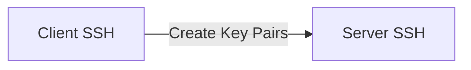

# awx-lab

## BlueShift Schedule

```mermaid
gantt
    dateFormat  YYYY-MM-DD
    title       BlueShift ICS Conversion
    excludes    weekends
    %% (`excludes` accepts specific dates in YYYY-MM-DD format, days of the week ("sunday") or "weekends", but not the word "weekdays".)

    section Azure Network
    Resource Group Creation           :done,    des1, 2022-02-01, 14d
    vNet Creation                     :done,  des2, 3d
    vHub Configurations               :des3, after des2, 5d
    Future task2                      :des4, after des3, 5d

    section Azure Storage
    Completed task            :done,    des1, 2014-01-06,2014-01-08
    Active task               :active,  des2, 2014-01-09, 3d
    Future task               :         des3, after des2, 5d
    Future task2              :         des4, after des3, 5d

    section Azure Compute - IaaS
    Completed task            :done,    des1, 2014-01-06,2014-01-08
    Active task               :active,  des2, 2014-01-09, 3d
    Future task               :         des3, after des2, 5d
    Future task2              :         des4, after des3, 5d

    section Azure Compute - PaaS - OpenShift
    Completed task            :done,    des1, 2014-01-06,2014-01-08
    Active task               :active,  des2, 2014-01-09, 3d
    Future task               :         des3, after des2, 5d
    Future task2              :         des4, after des3, 5d

    section Azure Compute - PaaS - AKS
    Completed task            :done,    des1, 2014-01-06,2014-01-08
    Active task               :active,  des2, 2014-01-09, 3d
    Future task               :         des3, after des2, 5d
    Future task2              :         des4, after des3, 5d


    section Critical tasks
    Completed task in the critical line :crit, done, 2014-01-06,24h
    Implement parser and jison          :crit, done, after des1, 2d
    Create tests for parser             :crit, active, 3d
    Future task in critical line        :crit, 5d
    Create tests for renderer           :2d
    Add to mermaid                      :1d
    Functionality added                 :milestone, 2014-01-25, 0d

    section Documentation
    Describe gantt syntax               :active, a1, after des1, 3d
    Add gantt diagram to demo page      :after a1  , 20h
    Add another diagram to demo page    :doc1, after a1  , 48h

    section Last section
    Describe gantt syntax               :after doc1, 3d
    Add gantt diagram to demo page      :20h
    Add another diagram to demo page    :48h

```

## SSH Key Exchange Strategy

### Manual command to exchange SSH keys for Ansible SSH authentication

### Manual command to create SSH keys on a remote host

```
ansible app -m shell -a "ssh-keygen -q -b 2048 -t rsa -N '' -C 'creating SSH' -f ~/.ssh/id_rsa creates='~/.ssh/id_rsa'" -i ansible_hosts -b --become-user=<desired end user>
```

### Playbook to combined creation and exchange

```
---
- hosts: all
  gather_facts: no
  become: yes

  vars:
  - default_users: ['nobody']
  - required_users: ['required_peeps']

  tasks:
  - name: Get a list of all users
    shell: "getent passwd | awk -F: '$3 > 1000 {print $1}'"
    changed_when: false
    register: users

  - name: Remove all users
    user:
      name: "{{ item }}"
      state: absent
      remove: yes
    with_items: "{{ users.stdout_lines }}"
    when: item not in default_users

  - name: Add required users
    user:
      name: "{{ item }}"
      state: present
    with_item: "{{ required_users }}"

  - name: Add SSH public keys
    authorized_key:
      user: "{{ item }}"
      state: present
      key: "{{ lookup('file', 'keys/{{ item }}') }}"
    with_item: "{{ required_users }}"

```

```
---
- name: Exchange Keys between servers
  become: yes
  become_user: "{{ user_name }}"
  hosts: all
  tasks:
    - name: SSH KeyGen command
      shell: > 
        ssh-keygen -q -b 2048 -t rsa -N "" -C "creating SSH" -f ~/.ssh/id_rsa
        creates="~/.ssh/id_rsa"
    - name: Fetch the keyfile from one server to another
      fetch: 
        src: "~/.ssh/id_rsa.pub"
        dest: "buffer/{{ansible_hostname}}-id_rsa.pub"
        flat: yes
    - name: Copy the file from master to the destination
      copy:
        src: "buffer/{{item.dest}}-id_rsa.pub"
        dest: "/tmp/remote-id_rsa.pub"  
      when: "{{ item.dest != ansible_hostname }}"
      with_items: 
        - { dest: "{{groups['app'][1]}}"}
        - { dest: "{{groups['app'][0]}}"}
    - name: add the public key into Authorized_keys file to enable Key Auth
      shell: "cat /tmp/remote-id_rsa.pub >> ~/.ssh/authorized_keys"
      register: addtoauth
```

```
---
- name: Exchange Keys between servers
  become: yes
  become_user: "{{ user_name }}"
  hosts: app
  tasks:
    - name: SSH KeyGen command
      tags: run
      shell: > 
        ssh-keygen -q -b 2048 -t rsa -N "" -C "creating SSH" -f ~/.ssh/id_rsa
        creates="~/.ssh/id_rsa"
    - name: Fetch the keyfile from one server to another
      tags: run
      fetch: 
        src: "~/.ssh/id_rsa.pub"
        dest: "buffer/{{ansible_hostname}}-id_rsa.pub"
        flat: yes
    - name: Copy the key add to authorized_keys using Ansible module
      tags: run
      authorized_key:
        user: weblogic
        state: present
        key: "{{ lookup('file','buffer/{{item.dest}}-id_rsa.pub')}}"
      when: "{{ item.dest != ansible_hostname }}"
      with_items: 
        - { dest: "{{groups['app'][1]}}"}
        - { dest: "{{groups['app'][0]}}"}
```

```
---
- name: Exchange Keys between servers
  hosts: multi
  tasks:
    - name: SSH KeyGen command
      tags: run
      shell: > 
        ssh-keygen -q -b 2048 -t rsa -N "" -C "creating SSH" -f ~/.ssh/id_rsa
        creates="~/.ssh/id_rsa"

    - name: Fetch the keyfile from the node to master
      tags: run
      fetch: 
        src: "~/.ssh/id_rsa.pub"
        dest: "buffer/{{ansible_hostname}}-id_rsa.pub"
        flat: yes

    - name: Copy the key add to authorized_keys using Ansible module
      tags: runcd
      authorized_key:
        user: vagrant
        state: present
        key: "{{ lookup('file','buffer/{{item}}-id_rsa.pub')}}"
      when: "{{ item != ansible_hostname }}"
      with_items: 
        - "{{ groups['multi'] }}" 
```



##


