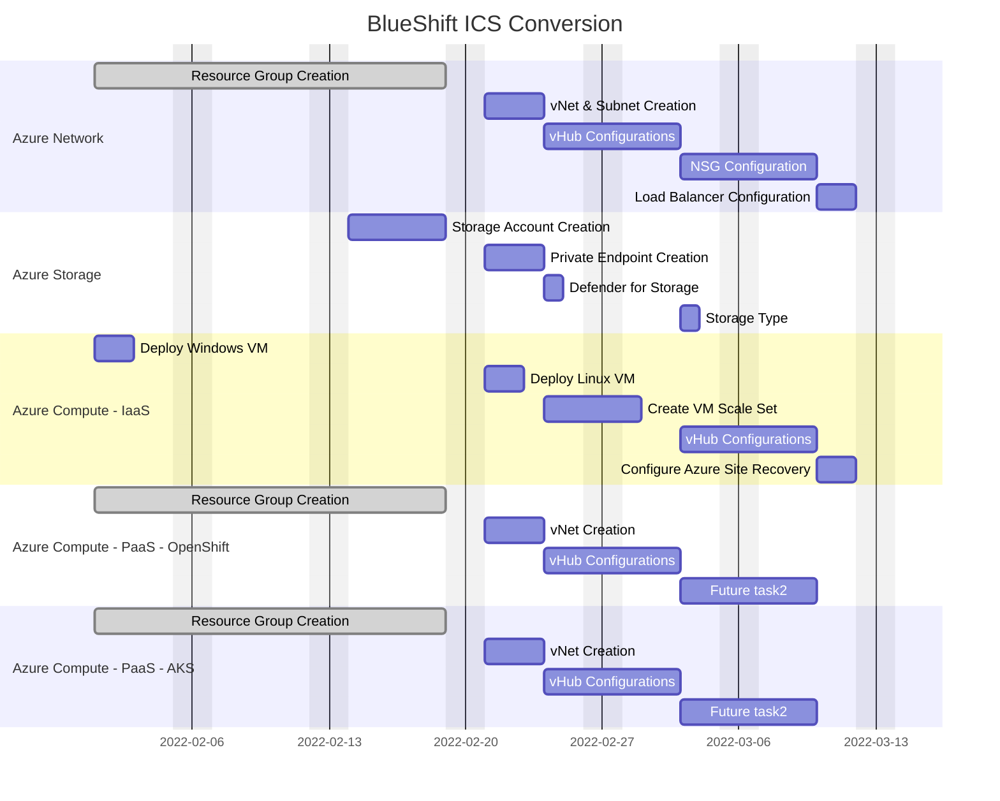

# awx-lab

## BlueShift Schedule



## SSH Key Exchange Strategy

### Manual command to exchange SSH keys for Ansible SSH authentication

### Manual command to create SSH keys on a remote host

```
ansible app -m shell -a "ssh-keygen -q -b 2048 -t rsa -N '' -C 'creating SSH' -f ~/.ssh/id_rsa creates='~/.ssh/id_rsa'" -i ansible_hosts -b --become-user=<desired end user>
```

### Playbook to combined creation and exchange

```
---
- hosts: all
  gather_facts: no
  become: yes

  vars:
  - default_users: ['nobody']
  - required_users: ['required_peeps']

  tasks:
  - name: Get a list of all users
    shell: "getent passwd | awk -F: '$3 > 1000 {print $1}'"
    changed_when: false
    register: users

  - name: Remove all users
    user:
      name: "{{ item }}"
      state: absent
      remove: yes
    with_items: "{{ users.stdout_lines }}"
    when: item not in default_users

  - name: Add required users
    user:
      name: "{{ item }}"
      state: present
    with_item: "{{ required_users }}"

  - name: Add SSH public keys
    authorized_key:
      user: "{{ item }}"
      state: present
      key: "{{ lookup('file', 'keys/{{ item }}') }}"
    with_item: "{{ required_users }}"

```

```
---
- name: Exchange Keys between servers
  become: yes
  become_user: "{{ user_name }}"
  hosts: all
  tasks:
    - name: SSH KeyGen command
      shell: > 
        ssh-keygen -q -b 2048 -t rsa -N "" -C "creating SSH" -f ~/.ssh/id_rsa
        creates="~/.ssh/id_rsa"
    - name: Fetch the keyfile from one server to another
      fetch: 
        src: "~/.ssh/id_rsa.pub"
        dest: "buffer/{{ansible_hostname}}-id_rsa.pub"
        flat: yes
    - name: Copy the file from master to the destination
      copy:
        src: "buffer/{{item.dest}}-id_rsa.pub"
        dest: "/tmp/remote-id_rsa.pub"  
      when: "{{ item.dest != ansible_hostname }}"
      with_items: 
        - { dest: "{{groups['app'][1]}}"}
        - { dest: "{{groups['app'][0]}}"}
    - name: add the public key into Authorized_keys file to enable Key Auth
      shell: "cat /tmp/remote-id_rsa.pub >> ~/.ssh/authorized_keys"
      register: addtoauth
```

```
---
- name: Exchange Keys between servers
  become: yes
  become_user: "{{ user_name }}"
  hosts: app
  tasks:
    - name: SSH KeyGen command
      tags: run
      shell: > 
        ssh-keygen -q -b 2048 -t rsa -N "" -C "creating SSH" -f ~/.ssh/id_rsa
        creates="~/.ssh/id_rsa"
    - name: Fetch the keyfile from one server to another
      tags: run
      fetch: 
        src: "~/.ssh/id_rsa.pub"
        dest: "buffer/{{ansible_hostname}}-id_rsa.pub"
        flat: yes
    - name: Copy the key add to authorized_keys using Ansible module
      tags: run
      authorized_key:
        user: weblogic
        state: present
        key: "{{ lookup('file','buffer/{{item.dest}}-id_rsa.pub')}}"
      when: "{{ item.dest != ansible_hostname }}"
      with_items: 
        - { dest: "{{groups['app'][1]}}"}
        - { dest: "{{groups['app'][0]}}"}
```

```
---
- name: Exchange Keys between servers
  hosts: multi
  tasks:
    - name: SSH KeyGen command
      tags: run
      shell: > 
        ssh-keygen -q -b 2048 -t rsa -N "" -C "creating SSH" -f ~/.ssh/id_rsa
        creates="~/.ssh/id_rsa"

    - name: Fetch the keyfile from the node to master
      tags: run
      fetch: 
        src: "~/.ssh/id_rsa.pub"
        dest: "buffer/{{ansible_hostname}}-id_rsa.pub"
        flat: yes

    - name: Copy the key add to authorized_keys using Ansible module
      tags: runcd
      authorized_key:
        user: vagrant
        state: present
        key: "{{ lookup('file','buffer/{{item}}-id_rsa.pub')}}"
      when: "{{ item != ansible_hostname }}"
      with_items: 
        - "{{ groups['multi'] }}" 
```


##


