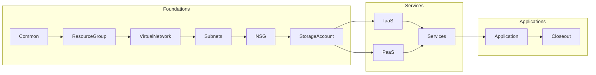

# Azure BlueShift Role

This role is used to create a standardized resource group inside of the Azure Landing Zone of target. Two files exist to control this role: 

- azure-blueshift-role.yml - Create the entire standard Azure BlueShift Resource Group. 

- azure-blueshift-orchestration.yml - Created to trigger instances of the role without running through all roles using tags. 

Example tag execution: 

ansible-playbook azure-blueshift-orchestration.yml --tags CreateRG

## Role Workflow

### Common

---

Orchestration Tag: **Common**

- [ ] Tasks that involve setup
- [ ] Get KeyVault Values
- [ ] Set up packages for delivery

#### Resource Group

---

Orchestration Tag: **CreateRG**

- [x] Created with 1 region
- [ ] Need to create based on tags

### Virtual Network

---

Orchestration Tag: **CreateVnet**

- [x] Sets up CIDR range
- [ ] Also sets up base for peering

### Subnets

---

Orchestration Tag: **CreateSubnets**

- [x] Assigns subnets for each area
- [x] Creates initial NSG's for setup

### NSG

---

Orchestration Tag: **CreateNSG**

- [x] Creates and updates existing Network Security Groups

### Storage Account

---

Orchestration Tag: **CreateStorageAccount**

- [x] Builds an Azure Storage Account
- [x] Sets the default access
- [ ] Set up private endpoint 
- [ ] Set up threst protection

### IaaS

---

Orchestration Tag: **CreateIaaS**

- [ ] Lays down a Virtual Maachine inside of the Subnets
- [ ] Creates vNIC and public/private IP addresses
- [ ] Install required extensions
- [ ] Constrain with Desired State
- [ ] Applys NSG

### PaaS

---

Orchestration Tag: **CreatePaaS**

- [ ] Sets up platform in each subnet
- [ ] Collect all REST API's for handoff to Shared Services
- [ ] Plumb Ingress points to gateways and Load Balancers
- [ ] Configure NAT for WAF connection

### Services

---

Orchestration Tag: **CreateServices**

- [ ] Load balancers
- [ ] Key Vaults
- [ ] Gateway API
- [ ] Application Gateways
- [ ] Site Recovery
- [ ] Observability, Monitoring, Metrics
- [ ] Middleware and Integration Platforms

### Application

---

Orchestration Tag: **CreateApplication**

- [ ] Get code from Repository
- [ ] Install in correct location
- [ ] Set up application to start correctly
- [ ] Ensure all tools are installed and ready for production release

### Closeout

---

Orchestration Tag: **Closeout**

- [ ] Test release
- [ ] Report on performance
- [ ] Update ServiceNow/CMDB

## Used Variables

| Variable Name | Description | Example | Used In Role |
| :--- | :--- | :--- | :--- |
| rg_name | Resource Group Name | StormWatch | All roles |
| vnet_name | Name of the Virtual Network | StormvNet1 | VirtualNetwork, Subnets |
| App-name | Name of the Application | Spandex | Subnets |
| vnic_name | Name of the virtual NIC | Spandex-vnic | vNIC |
| storage_account_name | Name of the storage account | App-SA | StorageAccount |

## Manage IQ and Ansible Tower Configurations

### BlueShift Azure Standard Resource Group

### Ansible Tower

#### Ansible Tower Role Orchestration Execution Using Tags

#### Ansible Tower Full Azure BlueShift Role

#### Ansible Tower Full Role Job Output

#### Ansible Tower Job Submission from Manage IQ

### Manage IQ

#### Ansible Tower Template Connected To Manage IQ

#### Manage IQ Service Catalog Item Configuration

#### Manage IQ Service Catalog Full Screen Order

#### Manage IQ Service Catalog Item Screen Order Detailed

#### Manage IQ Survey for Azure BlueShift Service Order

#### Manage IQ Provisioned Service

#### Manage IQ - Available Resource For Service Addition And Tracking

### Azure Output

#### Azure Resource Group Created

#### Azure Resource Group Details

## Todo

- [ ] Address service peering requirements
- [ ] Finish other base functions
- [ ] Start planning for Desired State Configuration