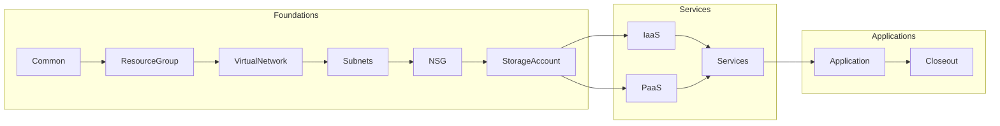

# Azure BlueShift Role

## Role Workflow

### Common

---
- [ ] Tasks that involve setup 
- [ ] Get KeyVault Values
- [ ] Set up packages for delivery

#### Resource Group

---
- [x] Created with 1 region
- [ ] Need to create based on tags

### Virtual Network

---
- [x] Sets up CIDR range
- [ ] Also sets up base for peering

### Subnets

---
- [x] Assigns subnets for each area
- [x] Creates initial NSG's for setup

### NSG

---
- [x] Creates and updates existing Network Security Groups

### Storage Account

---
- [x] Builds an Azure Storage Account
- [x] Sets the default access

### IaaS

---
- [ ] Lays down a Virtual Maachine inside of the Subnets
- [ ] Creates vNIC and public/private IP addresses
- [ ] Applys NSG

### PaaS

---
- [ ] Sets up platform in each subnet

### Services

---
- [ ] Load balancers
- [ ] Key Vaults
- [ ] Gateway API
- [ ] Application Gateways
- [ ] Site Recovery
- [ ] Observability, Monitoring, Metrics
- [ ] Middleware and Integration Platforms

### Application

---

### Closeout

---

## Used Variables

| Variable Name | Description | Example | Used In Role |
| :--- | :--- | :--- | :--- |
| rg_name | Resource Group Name | StormWatch | All roles |
| vnet_name | Name of the Virtual Network | StormvNet1 | VirtualNetwork, Subnets |
| App-name | Name of the Application | Spandex | Subnets |
| vnic_name | Name of the virtual NIC | Spandex-vnic | vNIC |
| storage_account_name | Name of the storage account | App-SA | StorageAccount |

## Manage IQ and Ansible Tower Configurations

### BlueShift Azure Standard Resource Group

### Ansible Tower

### Manage IQ

#### Ansible Tower Template Connected To Manage IQ

#### Manage IQ Service Catalog Item Configuration

#### Manage IQ Service Catalog Full Screen Order

#### Manage IQ Service Catalog Item Screen Order Detailed

#### Manage IQ Survey for Azure BlueShift Service Order

#### Manage IQ Provisioned Service

#### Manage IQ - Available Resource For Service Addition And Tracking

### Azure Output

#### Azure Resource Group Created

#### Azure Resource Group Details

## Todo

- [ ] Address service peering requirements
- [ ] Finish other base functions
- [ ] Start planning for Desired State Configuration