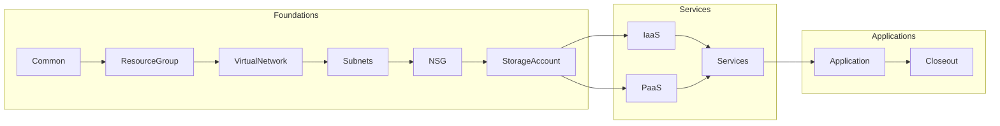

# Azure BlueShift Role

## Role Workflow

## Used Variables

| Variable Name | Description | Example | Used In Role |
| :--- | :--- | :--- | :--- |
| rg_name | Resource Group Name | StormWatch | All roles |
| vnet_name | Name of the Virtual Network | StormvNet1 | VirtualNetwork, Subnets |
| App-name | Name of the Application | Spandex | Subnets |
| vnic_name | Name of the virtual NIC | Spandex-vnic | vNIC |
| storage_account_name | Name of the storage account | App-SA | StorageAccount |

## Manage IQ and Ansible Tower Configurations

### Ansible Tower

### Manage IQ

### Azure Output

## Todo

- [ ] Address service peering requirements
- [ ] Finish other base functions
- [ ] Start planning for Desired State Configuration