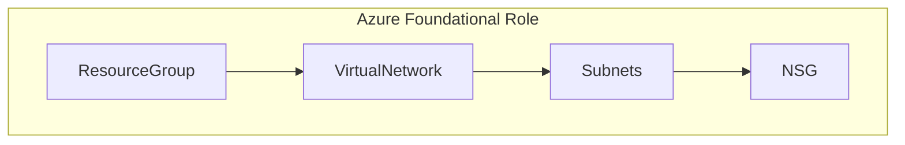

## Role Workflow

## Used Variables 
| Variable Name | Description | Example | Used In Role |
| :--- | :--- | :--- | :--- |
| rgname | Resource Group Name | StormWatch | All roles |
| vnet_name | Name of the Virtual Network | StormvNet1 | VirtualNetwork, Subnets |
| App-name | Name of the Application | Spandex | Subnets |

