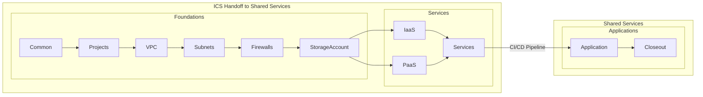
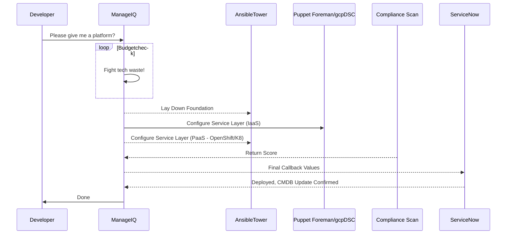

# GCP BlueShift Role

This role is used to create a standardized resource group inside of the GCP Landing Zone of target. Two files exist to control this role:

- gcp-blueshift-role.yml - Create the entire standard gcp BlueShift Resource Group.

- gcp-blueshift-orchestration.yml - Created to trigger instances of the role without running through all roles using tags.

Example tag execution:

ansible-playbook gcp-blueshift-orchestration.yml --tags CreateRG

## Role Workflow

Each subrole listed below is a standalone function that can be called independantly in a catalog item. Services provided by Manage IQ are made up of catalog items that are executed in the desired order.

## Process Execution

## BlueShift Subroles

Roles that combined to create the standard gcp BlueShift resource group.

### Common

---

Example execution:

ansible-playbook gcp-blueshift-orchestration.yml --tags **Common**

Orchestration Tag: **Common**

- [ ] Tasks that involve setup
- [ ] Get KeyVault Values
- [ ] Set up packages for delivery

#### Resource Group

---

Example Execution:

ansible-playbook gcp-blueshift-orchestration.yml --tags **CreateProject**

Orchestration Tag: **CreateProject**

- [x] Created with 1 region
- [ ] Need to create based on tags
- [ ] Create reginal pair

### VPC

---

Example Execution:

ansible-playbook gcp-blueshift-orchestration.yml --tags **CreateVPC**

Orchestration Tag: **CreateVPC**

- [x] Sets up CIDR range
- [ ] Also sets up base for peering

### Subnets

---

Example Execution:

ansible-playbook gcp-blueshift-orchestration.yml --tags **CreateSubnets**

Orchestration Tag: **CreateSubnets**

- [x] Assigns subnets for each area
- [x] Creates initial NSG's for setup

### Firewalls

---

Example Execution:

ansible-playbook gcp-blueshift-orchestration.yml --tags **CreateFirewalls**

Orchestration Tag: **CreateFirewalls**

- [x] Creates and updates existing Network Security Groups

### Storage Account

---

Example Execution:

ansible-playbook gcp-blueshift-orchestration.yml --tags **CreateStorageAccount**

Orchestration Tag: **CreateStorageAccount**

- [x] Builds an gcp Storage Account
- [x] Sets the default access
- [ ] Set up private endpoint
- [ ] Set up threat protection

### IaaS

---

Example Execution:

ansible-playbook gcp-blueshift-orchestration.yml --tags **CreateIaaS**

Orchestration Tag: **CreateIaaS**

- [x] Lays down a Virtual Maachine inside of the Subnets
- [x] Creates vNIC and public/private IP addresses
- [x] Install required extensions
- [ ] Constrain with Desired State
- [x] Applys NSG

### PaaS

---

Example Execution:

ansible-playbook gcp-blueshift-orchestration.yml --tags **CreatePaaS**

Orchestration Tag: **CreatePaaS**

- [ ] Sets up platform in each subnet
- [ ] Collect all REST API's for handoff to Shared Services
- [ ] Plumb Ingress points to gateways and Load Balancers
- [ ] Configure NAT for WAF connection

### Services

---

Example Execution:

ansible-playbook gcp-blueshift-orchestration.yml --tags **CreateServices**

Orchestration Tag: **CreateServices**

- [ ] Load balancers
- [ ] Key Vaults
- [ ] Gateway API
- [ ] Application Gateways
- [ ] Site Recovery
- [ ] Message Queues
- [ ] EventBus/Logic
- [ ] Observability, Monitoring, Metrics
- [ ] Middleware and Integration Platforms

### Application

---

Example Execution:

ansible-playbook gcp-blueshift-orchestration.yml --tags **CreateApplication**

Orchestration Tag: **CreateApplication**

- [ ] Get code from Repository
- [ ] Install in correct location
- [ ] Set up application to start correctly
- [ ] Ensure all tools are installed and ready for production release

### Closeout

---

Example Execution:

ansible-playbook gcp-blueshift-orchestration.yml --tags **Closeout**

Orchestration Tag: **Closeout**

- [ ] Test release
- [ ] Report on performance
- [ ] Update ServiceNow/CMDB

## Used Variables

| Variable Name | Description | Example | Used In Role |
| :--- | :--- | :--- | :--- |
| rg_name | Resource Group Name | StormWatch | All roles |
| vnet_name | Name of the Virtual Network | StormvNet1 | VirtualNetwork, Subnets |
| App-name | Name of the Application | Spandex | Subnets |
| vnic_name | Name of the virtual NIC | Spandex-vnic | vNIC |
| storage_account_name | Name of the storage account | App-SA | StorageAccount |

## Manage IQ and Ansible Tower Configurations

### BlueShift gcp Standard Resource Group

### Ansible Tower

#### Ansible Tower Role Orchestration Execution Using Tags

#### Ansible Tower Full gcp BlueShift Role

#### Ansible Tower Full Role Job Output

#### Ansible Tower Job Submission from Manage IQ

### Manage IQ

#### Ansible Tower Template Connected To Manage IQ

#### Manage IQ Service Catalog Item Configuration

#### Manage IQ Service Catalog Full Screen Order

#### Manage IQ Service Catalog Item Screen Order Detailed

#### Manage IQ Survey for gcp BlueShift Service Order

#### Manage IQ Provisioned Service

#### Manage IQ - Available Resource For Service Addition And Tracking

### gcp Output

#### gcp Resource Group Created

#### gcp Resource Group Details

## Todo

- [ ] Address service peering requirements
- [ ] Finish other base functions
- [ ] Start planning for Desired State Configuration
